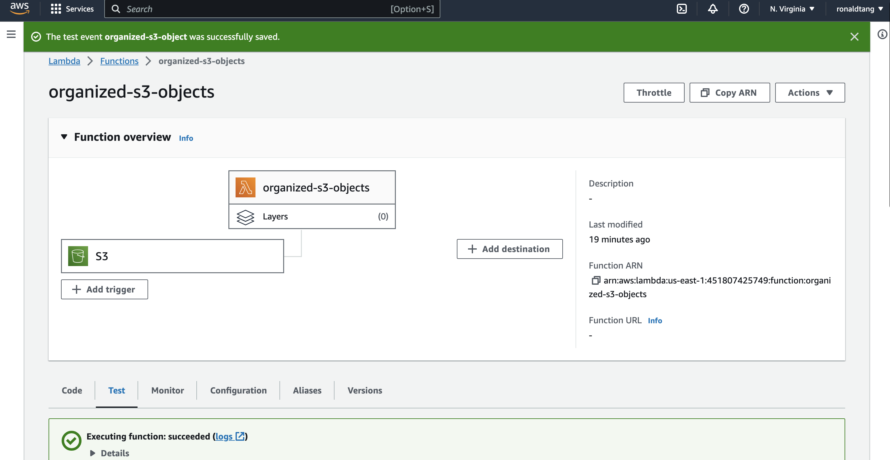
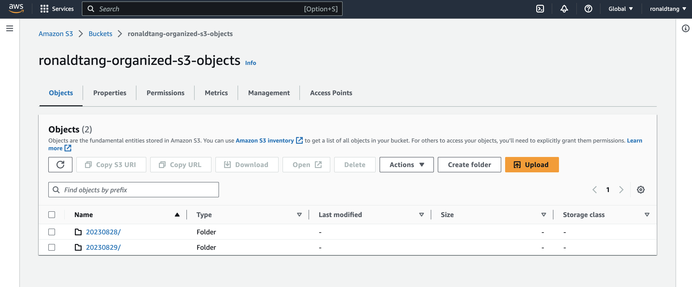

# AWS Project - Organized S3 Objects

## Ronald Tang

### Project 1 Requirements:

*Three parts:*

1. use Python and Lambda Functions to automate tasks in AWS.
2. create a Lambda Function that triggers when a file is added to an S3 bucket
3. moves it to a folder with the format YYYYMMDD/filename, based on the file's creation date

#### Assignment Screenshots:

| Screenshot of Lambda function and Trigger | Screenshot of organized S3 bucket |
| ---------- | ---------- |
|  |  | 

